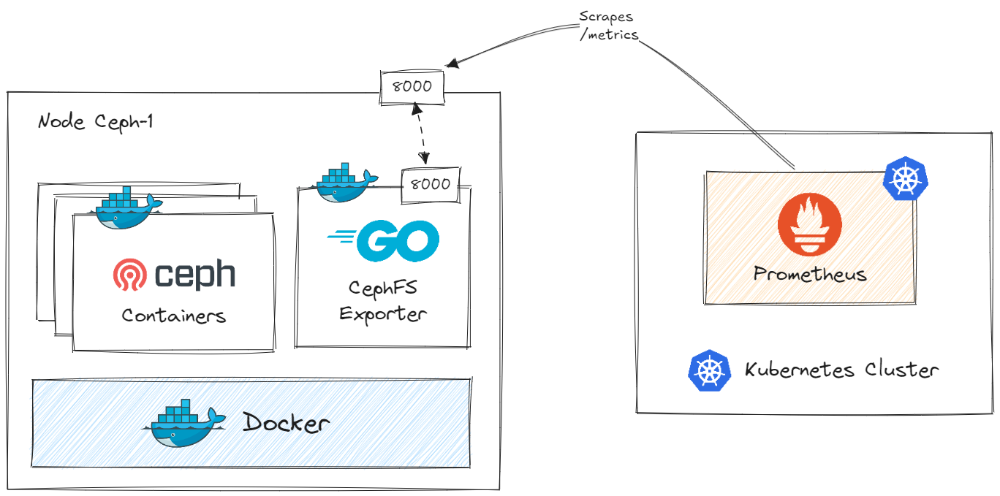
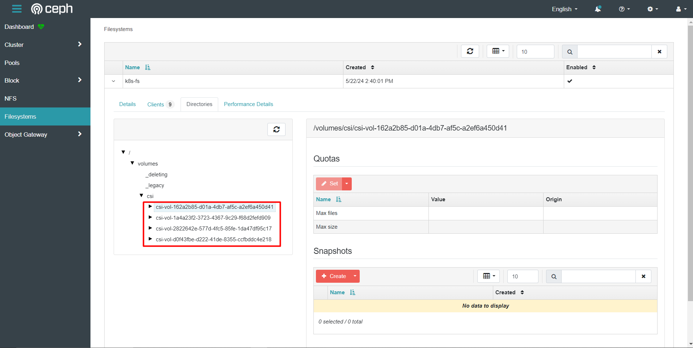
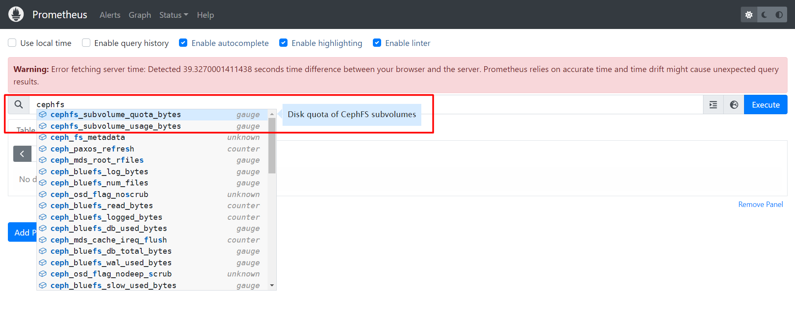

# CephFS Usage Exporter 📺

The goal of this project is to **monitor CephFS subvolumes disk usage using Prometheus**. The Ceph REST API does not natively support fetching disk usage metrics for CephFS subvolumes. So we need to set up a `Ceph exporter` that can scrape metrics from our Ceph cluster and make them available to Prometheus. 

By using the `ceph fs subvolume info` command and integrating it with a `custom Prometheus exporter`, we can efficiently **monitor CephFS subvolume disk usage**.

<p align="center">  </p>

## Prerequisites
- Healthy Ceph cluster
- Ceph file system
- Prometheus
- Docker

## Check Ceph CLI Command
> Make sure you have ceph-cli installed. If not, `apt -y install cephadm && cephadm install ceph-common`

In one of ceph cluster node, try to execute command below to get information about each subvolume. This command provides details like the size and path of the subvolume. 
```bash
ceph fs subvolume info <filesystem> <subvolume>
``` 
Example:
```bash
root@ceph-1:~$ ceph fs subvolume info k8s-fs /volumes/csi/csi-vol-162a2b85-d22a-4db7-af5c-a2ef6a450d41

{
    "atime": "2024-07-16 02:41:04",
    "bytes_pcent": "0.00",
    "bytes_quota": 5368709120,
    "bytes_used": 11707,
    "created_at": "2024-07-16 02:41:04",
    "ctime": "2024-07-29 08:43:43",
    "data_pool": "cephfs.k8s-fs.data",
    "features": [
        "snapshot-clone",
        "snapshot-autoprotect",
        "snapshot-retention"
    ],
    "gid": 0,
    "mode": 16877,
    "mon_addrs": [
        "10.0.0.1:6789",
        "10.0.0.2:6789",
        "10.0.0.3:6789"
    ],
    "mtime": "2024-07-29 08:43:43",
    "path": "/volumes/csi/csi-vol-162a2b85-d22a-4db7-af5c-a2ef6a450d41/d0f31c3a-6e41-466f-bde8-1f94f5a71cf8",
    "pool_namespace": "",
    "state": "complete",
    "type": "subvolume",
    "uid": 0
}
```

## Build Ceph exporter
The `exporter` written in `Golang` that periodically collects statistics for each subvolume and expose the metrics. 

1. Edit variables in main.go

    In the **main.go** main function, match varibles `filesystem` & `path` with your existing ceph filesystem that you wish to monitor. In my case, I want to monitor subvolumes of filesystem named `k8s-fs` that resides in path `/volumes/csi`

    ```go
    func main() {
        filesystem := "k8s-fs"
        path := "/volumes/csi"
        ...
    }
    ```
    <p align="center">  </p>

2. Build the Docker Image
    ```bash
    docker build -t cephfs-exporter:v1.0 .
    ```

3. Run the Docker Container
    
    Make sure you have appropriate permissions and Ceph configuration (ceph.conf and keyring) available within the container

    ```bash
    docker run -d -p 8000:8000 --name cephfs-exporter -v /etc/ceph:/etc/ceph cephfs-exporter:v1.0
    ```

4. Verify

    From your console, try to get the metrics endpoint
    ```bash
    curl http://localhost:8000/metrics
    ```
    You'll get output like this:
    ```
    # HELP cephfs_subvolume_quota_bytes Disk quota of CephFS subvolumes
    # TYPE cephfs_subvolume_quota_bytes gauge
    cephfs_subvolume_quota_bytes{subvolume="/volumes/csi/csi-vol-162a2b85-d01a-4db7-af5c-a2ef6a450d41"} 5.36870912e+09
    cephfs_subvolume_quota_bytes{subvolume="/volumes/csi/csi-vol-1a4a23f2-3723-4367-9c29-f68d2fefd909"} 5.36870912e+08
    cephfs_subvolume_quota_bytes{subvolume="/volumes/csi/csi-vol-2822642e-577d-4fc5-85fe-1da47df95c17"} 1.073741824e+10
    cephfs_subvolume_quota_bytes{subvolume="/volumes/csi/csi-vol-d0f43fbe-d222-41de-8355-ccfbddc4e218"} 5.36870912e+08
    # HELP cephfs_subvolume_usage_bytes Disk usage of CephFS subvolumes
    # TYPE cephfs_subvolume_usage_bytes gauge
    cephfs_subvolume_usage_bytes{subvolume="/volumes/csi/csi-vol-162a2b85-d01a-4db7-af5c-a2ef6a450d41"} 11707
    cephfs_subvolume_usage_bytes{subvolume="/volumes/csi/csi-vol-1a4a23f2-3723-4367-9c29-f68d2fefd909"} 25
    cephfs_subvolume_usage_bytes{subvolume="/volumes/csi/csi-vol-2822642e-577d-4fc5-85fe-1da47df95c17"} 4443
    cephfs_subvolume_usage_bytes{subvolume="/volumes/csi/csi-vol-d0f43fbe-d222-41de-8355-ccfbddc4e218"} 11
    ```

## Update Prometheus Configuration
Update our `prometheus.yml` configuration to scrape the metrics from the new exporter.

1. Edit Prometheus ConfigMap
    ```bash
    kubectl edit cm prometheus-server-conf -n monitoring
    ```
    ```
    apiVersion: v1
    data:
      prometheus.yml: |-
        ...
        scrape_configs:
          - job_name: 'cephfs-exporter'
            static_configs:
              - targets: ['10.10.0.21:8000']
    ```

2. Restart Prometheus Deployment
    ```bash
    kubectl rollout restart deployment prometheus-deployment -n monitoring
    ```

3. Find Cephfs metrics in Prometheus Dashboard

    Open your Prometheus dashboard. In my case, I exposed the prometheus via NodePort 30000. Try to write `cephfs` in the search bar and you should find cephfs metrics.
    <p align="center">  </p>